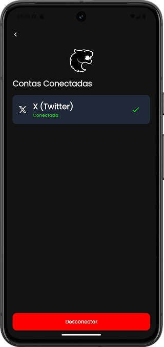

# Furia - Know Your Fan

## Table of Contents

- [Introdução](#introdução)
- [Preview](#preview)
- [Tecnologias Utilizadas](#tecnologias-utilizadas)
- [Como Usar](#como-usar)

## Introdução
- Know Your Fan é um aplicativo Android desenvolvido utilizando Kotlin Multiplatform para a etapa do desafio técnico para a vaga de Assistente de Engenharia de Software na Furia
- O objetivo deste aplicativo é que, o usuário forneça suas informações e tenha elas validadas por uma IA, para que ela possa retornar conteúdos relevantes

## Preview

## Tecnologias Utilizadas
- [Kotlin Multiplatform](https://kotlinlang.org/docs/multiplatform.html)
- [Jetpack Compose](https://developer.android.com/develop/ui/compose)
- [Koin](https://insert-koin.io) Injeção de Dependências
- [Ktor](https://ktor.io/) Chamadas à API
- [Coroutines](https://kotlinlang.org/docs/coroutines-overview.html) Operações Assíncronas
- [Firebase Authentication](https://firebase.google.com/docs/auth)
- [Firestore](https://firebase.google.com/docs/firestore)
- [SqlDelight](https://sqldelight.github.io/sqldelight/2.0.2/) para cache de dados
- [DataStore](https://developer.android.com/kotlin/multiplatform/datastore?hl=pt-br) para definir um intervalo entre as chamadas ao Gemini
- [Gemini](https://gemini.google.com/app)

## Como Usar
1. Clone este repositório `git clone https://github.com/GuilhermeIgnacio/KnowYourFan`
2. Abra este projeto no Android Studio
4. Configure um projeto no Firebase 
   - No Firestore, certifique-se de criar a coleção users para que os documentos sejam armazenados apropriadamente
   - No Authentication, certifique-se de habilitar os provedores necessários, e-mail e senha, e Twitter.
5. Certifique-se de substituir o valor da constante [GOOGLE_API_KEY](composeApp/src/commonMain/kotlin/com/guilherme/knowyourfan/knowyourfan/data/remote/api/gemini/GeminiImpl.kt) pela sua Api Key do Gemini Studio    
3. Faça o build e execute o projeto no seu dispositivo ou emulador Android

### Ou:

- Faça o Download do APK [aqui](composeApp/release/composeApp-release.apk)

---